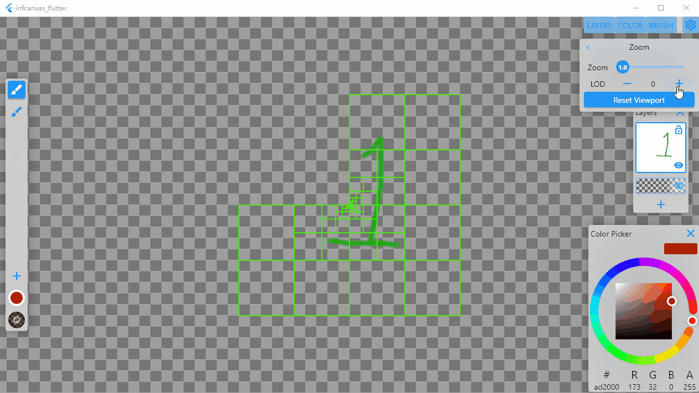

# Infcanvas

A drawing app with unlimited canvas size and scriptable brush pipeline

Because of default flutter engine not exposing relevant skia resources (`SkImage`, GPU Backed `SkCanvas`, `SkRuntimeEffect`, etc.), a modified [flutter engine](https://github.com/0x5b25/infcanvas_flutter) is used. Please follown the instructions to [compile](https://github.com/flutter/flutter/wiki/Compiling-the-engine) and [use](https://github.com/flutter/flutter/wiki/The-flutter-tool#using-a-locally-built-engine-with-the-flutter-tool) a custom built engine.

Because of iOS sandbox restrictions,JIT based interpreters (`C# Mono`, `dotnet`, even `DartVM`) cannot be used. A [Direct Call Threading](http://www.cs.toronto.edu/~matz/dissertation/matzDissertation-latex2html/node6.html) interpreter is implemented to run the scriptable brush pipeline, targeting resonable performance and easy host integration.

## Quadtree

```
children index

 tl | tr
 00 | 01
----+---->
 bl | br
 10 | 11
    V


 canvas size = 2^3 = 8
           tree          LoD   depth                    offsets
        ____+____               0  <--root                +0    1 << (0-1)
       /         \		   	   
     _+_         _+_            1                         +1    1 << (1-1)
    /   \       /   \	   	   
   +     +     +     +          2                         +2    1 << (2-1)
  / \   / \   / \   / \	   	   
 #   # #   # #   # #   #   0    3  <--originDepth         +4    1 << (3-1)
	|   | |   | |   | |   |   1       <--subdivide nodes
	|   | |   | |   | |   |   2
	|   | |   | |   | |   |   3..
indices:                       index + offset = tree path
-4  -3-2  -1 0   1 2   3
MSB:                       
 2   2 1   0 0   1 2   2
```

## Interpreter

A direct call threading interpreter with generational GC. goto [repo](https://github.com/0x5b25/SimpleIntp.git).

## Screenshots

### Scriptable Brush Pipeline


### Unlimited Canvas Size



## File Structure

- `utilities` : Self contained function blocks, no dependencies outside its own folder
    - `async` : async guards, task schedulers, etc.
    - `serializer` : simple object serializer
    - `storage` : Application state saving and loading, amongst other io related functions
- `widgets` : Reusable visual elements
    - `functional` : Parts that serves a specific functional need, like tree view
    - `visual` : Vanilla widgets that are customized visually
- `scripting` : Visual scripting module
    - `editor` : VM Code editor and compilers
    - `shader_editor` : Shader code editor and compilers
- `canvas` : The work horse of the canvas UI system frontends
    - `tools` : Canvas UI tool plugins, like brush system, color palette, canvas viewer. Other tools like line guides, color picker, paint bucket are to be added.
- `brush_manager` : Glue logic between file system and tree viewer widget to  
                 manage brush data saved on disk

## TODO 
Please refer to [TODO.md](TODO.md)

## ISSUES

- Canvas viewport zooming mechanism is not accurate enough during LoD changes
- Increase VM robustness, capture VM errors as complete as possible ( No exception support in flutter engine project, sadly ), or the whole application will crash.
- Handle VM null access scenarios during script execution. Maybe exception handling needs to be added to VM?
- Since flutter 2.2, the [cross-context image passing trick](https://github.com/flutter/flutter/issues/44148#issuecomment-549970873) no longer works. ~~Currently viewport snapshot images needs to be transfered GPU -> CPU -> GPU to be used from dart safely, which tanked performance.~~ Currently SkPictureRecorder is used to record tree node layout during snapshot generation.

## Stretch Goals
- Freeform transforming
- Selection and masking
- Cut Copy Paste pixels
- Other sophisticated image processing (e.g. flood fill) tools which requires CPU support
- PSD file format support?
- Custom plugin support, since we already have a VM script runtime for brush pipeline. A major overhaul of the vm interpreter is needed though, as well as a compiler frontend and a well-ish defined scripting api are needed.

## Flutter Application

This project is a starting point for a Flutter application.

A few resources to get you started if this is your first Flutter project:

- [Lab: Write your first Flutter app](https://flutter.dev/docs/get-started/codelab)
- [Cookbook: Useful Flutter samples](https://flutter.dev/docs/cookbook)

For help getting started with Flutter, view our
[online documentation](https://flutter.dev/docs), which offers tutorials,
samples, guidance on mobile development, and a full API reference.
